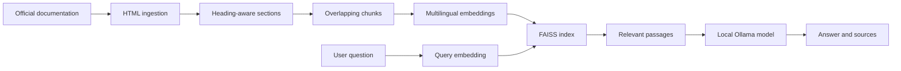

# Data Science Documentation RAG

A local Retrieval-Augmented Generation system that answers questions from selected official scikit-learn and pandas documentation. The project exposes each stage of the pipeline instead of hiding it behind an orchestration framework: controlled ingestion, HTML extraction, section-aware chunking, embeddings, FAISS retrieval, grounded local generation, and evaluation.

## What the project does

The assistant downloads an explicit allowlist of documentation pages and records their provenance. It extracts readable sections from the HTML, splits long sections into overlapping chunks, embeds them with a multilingual sentence-transformer model, and stores the normalized vectors in a FAISS index.

At query time, the assistant retrieves five candidate chunks, filters them for direct relevance, and sends at most three evidence passages to a local Ollama model. It answers in the language of the question and returns the source titles and URLs. If no retrieved passage contains sufficient evidence, it abstains.



## Technical choices

- Python 3.12
- Beautiful Soup and HTTPX for controlled documentation ingestion
- `intfloat/multilingual-e5-small` for normalized document and query embeddings
- FAISS `IndexFlatIP` for exact inner-product search, equivalent to cosine similarity on normalized vectors
- `qwen2.5:1.5b` through Ollama as a lightweight local generation baseline
- TOML configuration and a plain-text reusable prompt
- Standard-library unit tests and a 15-question evaluation set

The corpus configuration currently contains 25 official pages: 17 from scikit-learn and 8 from pandas. Downloaded pages, extracted data, embeddings, indexes, and model weights are reproducible artifacts and are therefore excluded from Git.

## Project structure

```text
RAG/
  config/                 Non-secret pipeline and source settings
  data/evaluation/        Versioned evaluation questions
  notebooks/              Guided end-to-end experiment
  prompts/                Reusable answer-generation prompt
  src/rag_assistant/      Pipeline implementation and CLI
  tests/                  Durable regression tests
  README.md
  pyproject.toml
```

## Installation

Create and activate a virtual environment from the repository root:

```powershell
python -m venv .venv
.\.venv\Scripts\Activate.ps1
python -m pip install --upgrade pip
python -m pip install -e ".[retrieval,generation,dev]"
```

Install the Ollama desktop application separately, then download the configured local model:

```powershell
ollama pull qwen2.5:1.5b
```

The first sentence-transformer load may take longer while its files are downloaded. Later sessions reuse the local Hugging Face cache. The document embeddings and FAISS index are also persisted, so they do not need to be rebuilt for each question.

## Build the local corpus and index

Run the pipeline stages in order:

```powershell
rag-assistant ingest
rag-assistant extract
rag-assistant chunk
rag-assistant embed --verbose
rag-assistant index
```

The commands create local files under `data/raw`, `data/processed`, and `artifacts`. These directories are ignored by Git because every artifact can be regenerated from `config/sources.toml`.

To inspect retrieval without generation:

```powershell
rag-assistant search "Comment traiter les valeurs manquantes ?"
```

## Ask questions locally

Start an interactive session:

```powershell
rag-assistant ask-session
```

The terminal displays only three main stages: loading local resources, searching the documentation, and generating the answer. The embedding model and FAISS index remain in memory for the whole session. Type `exit` to stop.

French queries are translated into English search terms because the indexed documentation is in English. Retrieval returns five candidates. A relevance step keeps up to three passages that directly address the question before generation. The answer prompt requires evidence-grounded prose and an explicit insufficient-evidence response when the corpus cannot answer.

Generation settings are centralized in `config/settings.toml`. The current baseline uses deterministic sampling, a 6,000-character evidence budget, a 1,200-token answer limit, a 120-second inactivity timeout, and a 30-minute Ollama keep-alive request.

## Notebook

Open `notebooks/rag_experiments.ipynb`, select the project virtual environment, restart the kernel, and run the cells from top to bottom. The notebook explains the data flow and inspects intermediate records rather than duplicating the reusable implementation in `src/rag_assistant`.

## Evaluation

Run the offline regression tests:

```powershell
python -m unittest discover -s tests -v
```

Run the end-to-end 15-question benchmark:

```powershell
rag-assistant evaluate
```

The benchmark covers English and French questions, single-source and multi-source tasks, and two questions that the corpus cannot answer. It writes an Excel-compatible CSV and a readable report under `artifacts/evaluation`. Those local reports contain generated outputs and are excluded from Git; the reusable question set remains versioned.

One local baseline run with `qwen2.5:1.5b` produced the following manually reviewed results:

| Measure | Result |
| --- | ---: |
| Answerable questions with an expected document in the top 5 | 13/13 |
| Answerable questions with an expected document at rank 1 | 12/13 |
| Answers rated good | 6/15 |
| Answers rated partial | 3/15 |
| Answers rated incorrect or unsafe | 6/15 |

This result separates retrieval quality from generation quality. Retrieval found the expected documentation reliably, while the small local model often failed on questions requiring precise distinctions or several constraints. Subsequent relevance filtering correctly rejected the two out-of-corpus questions in targeted checks, but the complete benchmark has not yet been rerun after that change.

## Limitations

- The source allowlist is intentionally narrow and does not represent all scikit-learn or pandas documentation.
- Dense retrieval alone can miss exact terminology; hybrid retrieval and reranking are future experiments.
- The relevance selector and generator use the same small local model, so difficult questions may still be answered incorrectly.
- A source label records which passage was supplied to the model. It does not prove that every generated claim is supported.
- The evaluation set is useful for iteration but too small for production claims.
- CPU latency depends on local hardware and the first model load is substantially slower than later questions in the same session.

## Data provenance

All source URLs are declared in `config/sources.toml`. Each ingestion run records the URL, retrieval timestamp, media type, and SHA-256 checksum. The repository does not redistribute the downloaded documentation; users rebuild the local corpus from the official scikit-learn and pandas websites.
